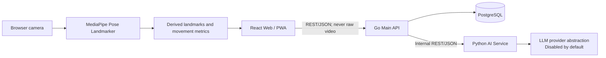

# KineGuide AI

**Personalized recovery, guided by AI.**

**KineGuide AI: A Personalized Physiotherapy Planning and Real-Time Pose Assessment System**

**ระบบปัญญาประดิษฐ์สำหรับวางแผนกายภาพบำบัดเฉพาะบุคคลและประเมินความถูกต้องของท่าทางแบบเรียลไทม์**

> KineGuide AI is a physiotherapy support and educational prototype. It does not provide medical diagnoses and does not replace a physician, physiotherapist, or other qualified healthcare professional.

## Table of contents

- [Overview](#overview)
- [Current foundation scope](#current-foundation-scope)
- [Architecture](#architecture)
- [Project structure](#project-structure)
- [Technology stack](#technology-stack)
- [Prerequisites](#prerequisites)
- [Setup](#setup)
- [Usage](#usage)
- [Environment variables](#environment-variables)
- [API and health checks](#api-and-health-checks)
- [Database migrations](#database-migrations)
- [Testing and quality](#testing-and-quality)
- [Development standards](#development-standards)
- [AI-agent workflow](#ai-agent-workflow)
- [Git workflow](#git-workflow)
- [Security and privacy](#security-and-privacy)
- [Known limitations](#known-limitations)
- [Roadmap](#roadmap)
- [FAQ](#faq)
- [Medical disclaimer](#medical-disclaimer)

## Overview

KineGuide AI is a university healthcare-AI project that aims to support personalized physiotherapy planning and real-time pose assessment. The system is designed around explicit clinical ownership, privacy, explainability, browser-side camera processing, and strict service boundaries.

This repository currently provides a functional monorepo foundation. It deliberately does not contain diagnosis, red-flag decisions, patient recommendations, exercise prescriptions, or a production LLM integration.

## Current foundation scope

Implemented:

- Thai-first responsive React/PWA application shell with English localization foundation
- System status page with loading, success, degraded, and failure states
- Typed web-to-Go health client
- Go health, readiness, dependency-status, OpenAPI, and Scalar API Reference endpoints
- PostgreSQL and Python AI readiness probes
- Internal FastAPI service with a deterministic disabled provider
- Minimal reversible PostgreSQL metadata migration and synthetic seed
- OpenAPI 3.1 source contract
- Dockerfiles, Compose, Caddy routing, CI, issue forms, and pull-request template
- Repository-wide agent guidance, scoped rules, and project-local skills
- Unit tests, static checks, dependency locks, and security-oriented Git exclusions
- Email/password authentication with short-lived JWT access tokens and rotating HttpOnly refresh cookies
- Versioned consent records, bounded structured assessment answers, and account deletion
- Reviewed-as-pending movement-demo catalogue and user-owned activity session summaries
- Responsive product routes from landing through dashboard, camera setup, live manual session, history, and progress
- Browser camera lifecycle with explicit permission and cleanup; raw media remains on-device

Not implemented yet:

- Red-flag screening rules
- Rehabilitation plan or exercise generation
- MediaPipe pose inference, automated repetition counting, or form scoring
- Real LLM provider integration
- Production deployment or regulatory certification

## Architecture



| Component         | Responsibility                                                               | Prohibited responsibility                                          |
| ----------------- | ---------------------------------------------------------------------------- | ------------------------------------------------------------------ |
| React Web/PWA     | UI, localization, consent presentation, browser camera, derived pose metrics | Direct database/AI access, diagnosis, raw-video upload             |
| Go Main API       | Public REST API, orchestration, authentication boundary, PostgreSQL access   | Browser camera processing, unreviewed clinical decisions           |
| Python AI Service | Bounded text processing through provider adapters                            | Primary database access, diagnosis, red-flag or exercise decisions |
| PostgreSQL        | Go-owned application records                                                 | Raw camera media, credentials, model artifacts                     |
| Caddy             | Integrated local routing                                                     | Business or clinical logic                                         |

Raw camera frames must stay in the browser. Only explicitly approved derived landmarks or movement metrics may cross the API boundary.

See [architecture overview](docs/architecture/overview.md) and [service boundaries](docs/architecture/service-boundaries.md).

## Project structure

```text
.
├── apps/
│   └── web/                         # React 19, TypeScript, Vite, Tailwind, PWA
│       ├── e2e/                     # Playwright browser tests
│       ├── public/                  # PWA assets
│       └── src/
│           ├── app/                 # Application providers and router
│           ├── components/          # Layout and app-wide UI
│           ├── features/            # Feature-oriented modules
│           ├── hooks/               # Shared React hooks
│           ├── lib/                 # Environment and i18n setup
│           ├── routes/              # Route-level screens and tests
│           ├── services/            # Typed HTTP/API clients
│           ├── stores/              # Client-only state when justified
│           ├── styles/              # Tailwind and global styles
│           ├── types/               # Shared frontend types
│           └── workers/             # Future browser pose workers
├── services/
│   ├── api-go/
│   │   ├── cmd/server/              # Go API entry point
│   │   ├── db/                      # sqlc queries and generated output
│   │   └── internal/
│   │       ├── client/ai/           # Internal Python service client
│   │       ├── config/              # Validated runtime configuration
│   │       ├── database/            # pgx pool
│   │       ├── handler/             # HTTP routes and tests
│   │       ├── middleware/          # Request ID, logging, CORS, recovery
│   │       └── security/            # Argon2id and JWT foundations
│   └── ai-python/
│       ├── app/
│       │   ├── api/routes/          # FastAPI routes
│       │   ├── core/                # Settings
│       │   ├── providers/           # LLM provider protocol/adapters
│       │   └── schemas/             # Pydantic API schemas
│       └── tests/                   # Pytest suite
├── packages/
│   ├── contracts/openapi/           # Public OpenAPI 3.1 source
│   └── ui/                          # Shared design-token guidance
├── database/
│   ├── migrations/                  # Paired up/down SQL migrations
│   └── seeds/                       # Synthetic development seeds
├── docs/
│   ├── api/
│   ├── architecture/
│   ├── clinical-references/
│   └── research/
├── research/
│   ├── datasets/                    # Policy only; datasets are ignored
│   ├── evaluation/
│   └── notebooks/
├── infrastructure/
│   ├── caddy/
│   └── docker/
├── .github/                         # CI and collaboration templates
├── docker-compose.yml
├── Makefile
└── README.md
```

## Technology stack

### Web

- React 19 and TypeScript
- Vite and Tailwind CSS 4
- React Router and TanStack Query
- Axios, React Hook Form, and Zod
- i18next and react-i18next
- Recharts and Lucide React
- Vite PWA, Vitest, Testing Library, and Playwright

### Go Main API

- Go, Gin, and standard `log/slog`
- pgx/v5 and pgxpool
- sqlc and golang-migrate foundations
- go-playground/validator
- golang-jwt/jwt/v5 and Argon2id
- Testify and `net/http/httptest`
- OpenAPI 3.1 and Scalar API Reference

### Python AI Service

- Python 3.12+
- FastAPI, Pydantic, and pydantic-settings
- HTTPX and Uvicorn
- uv lockfile
- Pytest, Ruff, and mypy

### Infrastructure

- PostgreSQL 17
- Docker and Compose
- Caddy
- GitHub Actions

## Prerequisites

- Node.js 24+ and Corepack
- Go 1.26+
- Python 3.12+
- Docker with Compose v2 for the integrated environment
- GNU Make is optional

Check installed tools:

```bash
node --version
corepack --version
go version
python --version
docker --version
docker compose version
```

## Setup

### 1. Clone and select `develop`

```bash
git clone <repository-url> kineguide-ai
cd kineguide-ai
git switch develop
```

No remote URL is embedded in this repository because the owner and hosting location are not yet defined.

### 2. Create local environment configuration

Linux/macOS:

```bash
cp .env.example .env
```

PowerShell:

```powershell
Copy-Item .env.example .env
```

`.env` is ignored. Replace every placeholder before using a shared or deployed environment.

### 3. Install frontend dependencies

```bash
corepack enable
corepack prepare pnpm@11.23.0 --activate
corepack pnpm install --frozen-lockfile
```

### 4. Install Go dependencies

```bash
cd services/api-go
go mod download
cd ../..
```

### 5. Install Python dependencies

With uv:

```bash
cd services/ai-python
uv sync --all-extras
cd ../..
```

With Python/pip:

```bash
cd services/ai-python
python -m venv .venv
python -m pip install -e ".[dev]"
cd ../..
```

On Windows, activate the environment with `.venv\Scripts\Activate.ps1` when using direct commands.

## Usage

### Run the integrated environment

```bash
docker compose up --build
```

Stop it safely:

```bash
docker compose down
```

The complete stack contains `web`, `api-go`, `ai-python`, `postgres`, and `caddy`. The Python service is internal by default.

### Run services separately

Terminal 1 — web:

```bash
corepack pnpm --filter @kineguide/web dev
```

Terminal 2 — Go API:

```bash
cd services/api-go
go run ./cmd/server
```

Terminal 3 — Python AI:

```bash
cd services/ai-python
uv run uvicorn app.main:app --reload --port 8001
```

### Make commands

```bash
make help
make setup
make dev
make build
make test
make lint
make typecheck
make migrate-up
make migrate-down
make seed
make down
```

Every Make target has an equivalent direct command in this README for Windows environments without GNU Make.

## Environment variables

| Variable               | Purpose                        | Development example            |
| ---------------------- | ------------------------------ | ------------------------------ |
| `APP_ENV`              | Runtime environment            | `development`                  |
| `APP_VERSION`          | Service version                | `0.1.0`                        |
| `WEB_PORT`             | Web host port                  | `5173`                         |
| `API_PORT`             | Go API host port               | `8080`                         |
| `AI_PORT`              | Direct Python development port | `8001`                         |
| `POSTGRES_PORT`        | PostgreSQL host port           | `5432`                         |
| `POSTGRES_DB`          | Database name                  | `kineguide`                    |
| `POSTGRES_USER`        | Database user                  | `kineguide`                    |
| `POSTGRES_PASSWORD`    | Local placeholder only         | `change-me`                    |
| `DATABASE_URL`         | Go-owned PostgreSQL connection | See `.env.example`             |
| `AI_SERVICE_URL`       | Go-to-Python internal URL      | `http://ai-python:8001`        |
| `CORS_ALLOWED_ORIGINS` | Explicit browser origins       | Local web/API origins          |
| `VITE_API_BASE_URL`    | Browser-to-Go base URL         | `http://localhost:8080/api/v1` |
| `LLM_PROVIDER`         | Python provider selection      | `disabled`                     |
| `LLM_API_KEY`          | Future provider secret         | Empty                          |

Service-specific examples are located at `apps/web/.env.example`, `services/api-go/.env.example`, and `services/ai-python/.env.example`.

## API and health checks

### Go Main API

| Method and path             | Purpose                                    |
| --------------------------- | ------------------------------------------ |
| `GET /health`               | Process liveness                           |
| `GET /ready`                | PostgreSQL and Python dependency readiness |
| `GET /api/v1/health`        | Versioned health response                  |
| `GET /api/v1/system/status` | Individual dependency states               |
| `GET /openapi.json`         | OpenAPI schema                             |
| `GET /docs`                 | Scalar API Reference                       |

### Python AI Service

| Method and path      | Purpose                   |
| -------------------- | ------------------------- |
| `GET /health`        | Process liveness          |
| `GET /ready`         | Provider readiness        |
| `GET /api/v1/health` | Versioned health response |
| `GET /openapi.json`  | FastAPI OpenAPI schema    |
| `GET /docs`          | Swagger UI                |
| `GET /redoc`         | ReDoc                     |

### Local URLs

- Web: <http://localhost:5173>
- Go API: <http://localhost:8080>
- Go docs: <http://localhost:8080/docs>
- Python direct docs: <http://localhost:8001/docs>
- Caddy integrated environment: <http://localhost>

Example:

```bash
curl http://localhost:8080/health
curl -i http://localhost:8080/ready
curl http://localhost:8001/health
```

A `503` from Go `/ready` is expected when PostgreSQL or Python is unavailable. Do not replace a real degraded state with a synthetic healthy response.

## Database migrations

Apply migrations:

```bash
docker compose run --rm --entrypoint /bin/sh migrate -c 'migrate -path=/migrations -database="$DATABASE_URL" up'
```

Roll back one migration:

```bash
docker compose run --rm --entrypoint /bin/sh migrate -c 'migrate -path=/migrations -database="$DATABASE_URL" down 1'
```

Run synthetic seeds after migrations:

```bash
docker compose exec -T postgres sh -c 'psql -U "$POSTGRES_USER" -d "$POSTGRES_DB" -f /seeds/001_application_metadata.sql'
```

Database rules:

- Use paired up/down migrations.
- Use UUID primary keys and UTC `timestamptz` values.
- Never edit an applied migration.
- Never seed real or realistic patient information.
- PostgreSQL remains accessible only through Go.

See [database design](docs/database-design.md).

## Testing and quality

### Unit tests

Unit tests isolate one module or behavior and replace external dependencies with deterministic adapters. They should be fast and explain the failure precisely.

```bash
corepack pnpm --filter @kineguide/web test
cd services/api-go && go test ./...
cd services/ai-python && uv run pytest
```

### Integration tests

Integration tests verify real boundaries such as handler-to-service, Go-to-PostgreSQL, Go-to-Python, migrations, and proxy routing. Use disposable infrastructure and synthetic data.

```bash
docker compose up --build
curl http://localhost:8080/ready
docker compose down
```

### End-to-end tests

Playwright verifies browser-visible flows and accessibility behavior:

```bash
corepack pnpm --filter @kineguide/web test:e2e
```

### Full quality checks

```bash
corepack pnpm format:check
corepack pnpm lint
corepack pnpm typecheck
corepack pnpm test
VITE_API_BASE_URL=/api/v1 corepack pnpm build

cd services/api-go
go fmt ./...
go vet ./...
go test ./...
go build ./cmd/server

cd ../ai-python
uv run ruff check .
uv run ruff format --check .
uv run mypy app
uv run pytest
```

OpenAPI and Compose:

```bash
corepack pnpm openapi:lint
docker compose config
```

Never claim a check passed unless it completed successfully.

## Development standards

### Naming

- TypeScript files and React components use the established nearby convention.
- Go exported names use PascalCase; unexported names use camelCase; initialisms remain consistent, such as `HTTP` and `ID`.
- Python uses snake_case functions/modules and PascalCase classes.
- Database names use lower snake_case.
- API JSON fields use lower snake_case consistently.

### Design

- Prefer small complete vertical slices over horizontal scaffolding.
- Avoid speculative abstractions and pass-through modules.
- Add interfaces only for a real alternate adapter, external seam, or deterministic test.
- Keep application-specific UI inside `apps/web`.
- Keep `main` files focused on wiring and lifecycle.
- Validate at trust boundaries and propagate bounded timeouts.
- Use structured logs and request IDs without sensitive payloads.

### Documentation synchronization

Update documentation in the same change when modifying:

- architecture or service ownership;
- endpoints, schemas, status codes, or errors;
- environment variables or ports;
- database migrations or planned entities;
- privacy, consent, retention, or clinical boundaries;
- developer commands or CI behavior.
- 
## Git workflow

```text
main
└── develop
    └── feature/<issue-number>-<short-name>
```

Examples:

```text
feature/12-red-flag-screening
feature/18-camera-calibration
feature/24-pose-detection
fix/31-camera-permission
docs/40-update-architecture
```

Rules:

1. Branch from `develop`.
2. Open focused pull requests into `develop`.
3. Link an issue and include `Closes #<issue-number>`.
4. Require one teammate review and passing CI.
5. Promote `develop` to `main` only for a verified release.
6. Delete merged feature branches.
7. Use Conventional Commits.

See [CONTRIBUTING.md](CONTRIBUTING.md) and [GitHub workflow](docs/github-workflow.md).

## Security and privacy

- Never commit secrets, `.env`, health information, datasets, recordings, uploads, or model artifacts.
- Keep raw camera media in the browser.
- Minimize collected data and define purpose, consent, access, retention, export, correction, and deletion.
- Keep Python AI stateless and isolated from the primary database.
- Redact logs and external errors.
- Use least privilege and deny access by default.
- Report vulnerabilities privately as described in [SECURITY.md](SECURITY.md).

See [privacy and security principles](docs/privacy-and-security.md).

This repository does not claim HIPAA, GDPR, PDPA, medical-device, or other regulatory compliance.

## Known limitations

- No clinician portal, clinical rule engine, rehabilitation-plan prescription workflow, or approved pose model exists yet.
- Movement demos remain clearly marked as pending clinical review and do not contain dosage, angle thresholds, or correctness scores.
- The AI provider is disabled and cannot generate medical advice.
- Browser-camera behavior is a planned boundary, not a completed feature.
- Production hosting, backups, monitoring, incident response, and regulatory review are not configured.
- Docker runtime depends on a healthy local Docker engine; `docker compose config` alone does not prove containers can start.
- Clinical references and qualified review are required before implementing safety or exercise rules.

## Roadmap

1. Authentication and authorization foundation
2. Consent and patient-profile boundaries
3. Structured symptom assessment
4. Clinician-owned safety screening and red-flag rules
5. Exercise library and reviewed protocols
6. Rehabilitation-plan workflow
7. Browser camera calibration and MediaPipe pose metrics
8. Session feedback and progress summaries
9. Controlled AI text-processing evaluation
10. Security, privacy, clinical, and usability validation

## FAQ

### Why can `/health` be healthy while `/ready` returns 503?

`/health` proves that the process is alive. `/ready` also checks PostgreSQL and Python AI. A dependency failure correctly makes readiness degraded.

### Why can the browser not call Python AI directly?

Go owns authentication, validation, orchestration, audit boundaries, and database access. Direct browser-to-Python calls would bypass those controls.

### Why is raw video not sent to the backend?

Camera frames are highly sensitive and unnecessary for the intended architecture. Pose inference runs in the browser and only approved derived metrics may be transmitted.

### Why is the LLM provider disabled?

The foundation must be deterministic and incapable of generating unreviewed medical advice. A real provider requires explicit schemas, consent, privacy, retention, safety evaluation, and secrets management.

### Where should a new React component live?

Keep feature-specific components in `apps/web/src/features/<feature>`. Move a component to `packages/ui` only after it has real cross-application reuse and a stable accessible API.

### Should I edit an existing migration?

No. Add a new paired migration. Applied migration history must remain immutable.

### Can I add a clinical threshold from an article or LLM answer?

Not directly. Add a traceable authoritative source and obtain qualified clinical review before encoding the rule.

### How do I add a GitHub remote?

Wait until the owner and visibility are explicitly confirmed. Do not invent organization names, usernames, or repository URLs.

## Medical disclaimer

KineGuide AI is a physiotherapy support and educational prototype. It does not provide medical diagnoses and does not replace a physician, physiotherapist, or other qualified healthcare professional.

KineGuide AI เป็นระบบต้นแบบสำหรับสนับสนุนและให้ความรู้ด้านกายภาพบำบัด ไม่ใช่เครื่องมือวินิจฉัยโรค และไม่สามารถใช้แทนแพทย์ นักกายภาพบำบัด หรือบุคลากรทางการแพทย์ที่มีคุณสมบัติเหมาะสมได้

