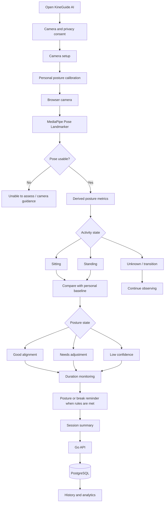

# KineGuide-AI

**Move better at your desk, guided by AI.**

**KineGuide AI: A Real-Time Posture Monitoring & Ergonomic Awareness System**

**ระบบ AI สำหรับติดตามท่าทางการนั่งและยืนแบบเรียลไทม์ด้วยกล้อง เพื่อช่วยให้ผู้ใช้ตระหนักและปรับพฤติกรรมการใช้งานหน้าจอ**

> KineGuide AI is an ergonomic-awareness and posture-monitoring prototype. It analyzes visible posture patterns and session duration; it does not diagnose pain, disease, injury, or medical conditions and does not prescribe treatment.

## Table of contents

- [Overview](#overview)
- [Product flow](#product-flow)
- [Current foundation scope](#current-foundation-scope)
- [Architecture](#architecture)
- [Project structure](#project-structure)
- [Technology stack](#technology-stack)
- [Prerequisites](#prerequisites)
- [Setup](#setup)
- [Usage](#usage)
- [Environment variables](#environment-variables)
- [API and health checks](#api-and-health-checks)
- [Database migrations](#database-migrations)
- [Testing and quality](#testing-and-quality)
- [Development standards](#development-standards)
- [Git workflow](#git-workflow)
- [Security and privacy](#security-and-privacy)
- [Known limitations](#known-limitations)
- [Roadmap](#roadmap)
- [FAQ](#faq)
- [Safety and scope disclaimer](#safety-and-scope-disclaimer)

## Overview

KineGuide AI is a university AI/computer-vision project for real-time posture monitoring during desk work, gaming, studying, and other prolonged screen use. The product uses the browser camera to estimate body landmarks, classify a session as sitting, standing, or unavailable, derive posture metrics, compare them with a user-specific calibration baseline, and provide non-diagnostic ergonomic feedback.

The project is **not** a symptom checker and no longer uses the flow `symptom → diagnosis → treatment/exercise plan`. The core product flow is `camera → pose estimation → posture metrics → sit/stand state → baseline comparison → feedback/reminder → session summary → history/analytics`.

Privacy remains a primary design boundary: raw camera frames stay on-device in the browser. The backend receives only explicitly approved derived session metrics needed for history or analytics.

## Product flow



### Real-time behavior

The first release should focus on observable, explainable posture signals rather than medical interpretation:

- detect whether the user is sitting, standing, transitioning, or cannot be assessed;
- estimate head/neck orientation, shoulder alignment, torso lean, hip alignment, and left/right body symmetry when the camera view supports those metrics;
- compare stable metrics with a per-user calibration baseline instead of assuming one body angle fits every user;
- debounce short movements so reaching for an object or briefly looking down does not immediately trigger an alert;
- track continuous sitting/standing time and configurable reminder intervals;
- show honest states such as **Good alignment**, **Needs adjustment**, **Low confidence**, and **Unable to assess**;
- store session summaries and posture events only when required for product features; never store raw camera video.

Posture thresholds, debounce durations, and reminder intervals are product parameters, not medical facts. They must be documented, testable, configurable where appropriate, and evaluated with representative users before being presented as reliable guidance.

## Current foundation scope

Implemented foundation:

- Thai-first responsive React/PWA application shell with English localization foundation
- System status page with loading, success, degraded, and failure states
- Typed web-to-Go health client
- Go health, readiness, dependency-status, OpenAPI, and Scalar API Reference endpoints
- PostgreSQL and Python AI readiness probes
- Internal FastAPI service with a deterministic disabled provider
- Minimal reversible PostgreSQL metadata migration and synthetic seed
- OpenAPI 3.1 source contract
- Dockerfiles, Compose, Caddy routing, CI, issue forms, and pull-request template
- Repository-wide agent guidance, scoped rules, and project-local skills
- Unit tests, static checks, dependency locks, and security-oriented Git exclusions
- Email/password authentication with short-lived JWT access tokens and rotating HttpOnly refresh cookies
- Versioned consent records and account deletion
- Responsive routes for landing, dashboard, camera setup, live session, history, and progress
- Browser camera lifecycle with explicit permission and cleanup; raw media remains on-device

Legacy behavior to remove or migrate during the posture-monitoring pivot:

- structured symptom-assessment UI/data that exists only for the former physiotherapy flow;
- movement-demo/exercise catalogue behavior that is no longer part of the core product;
- copy, routes, database fields, tests, and documentation that imply diagnosis, rehabilitation planning, or exercise prescription.

Not implemented yet:

- MediaPipe Pose Landmarker inference in the production browser flow
- camera-quality and landmark-visibility validation
- sitting / standing / transition classification
- personal posture calibration and baseline persistence policy
- posture metrics engine for head, shoulders, torso, hips, and symmetry
- stable posture-state evaluation with debounce/hysteresis and confidence handling
- continuous sitting/standing duration monitoring
- posture notifications and configurable break reminders
- posture session summaries, event history, and analytics dashboard backed by the Go API
- optional LLM-generated natural-language summaries constrained to non-medical session metrics
- production deployment and product validation

## Architecture

```mermaid
flowchart LR
    Camera[Browser camera] --> Pose[MediaPipe Pose Landmarker]
    Pose --> Quality[Pose quality / visibility gate]
    Quality --> Metrics[Derived posture metrics]
    Metrics --> Activity[Sit / stand / transition classifier]
    Activity --> Baseline[Personal baseline comparison]
    Baseline --> Feedback[Posture state + reminders]
    Feedback --> Web[React Web / PWA]
    Web -->|REST/JSON; never raw video| API[Go Main API]
    API --> DB[(PostgreSQL)]
    API -->|Optional internal REST/JSON| AI[Python AI Service]
    AI --> Provider[LLM provider abstraction<br/>Disabled by default]
```



| Component | Responsibility | Prohibited responsibility |
| --- | --- | --- |
| React Web/PWA | UI, localization, consent, browser camera, MediaPipe inference, derived posture metrics, calibration, sit/stand state, local feedback | Direct database access, raw-video upload, medical diagnosis or treatment claims |
| Go Main API | Public REST API, authentication, user settings, posture-session summaries, history/analytics orchestration, PostgreSQL access | Browser camera processing, inventing pose results, medical diagnosis |
| Python AI Service | Optional bounded natural-language summaries from approved structured metrics | Primary database access, primary posture classification, diagnosis, treatment, or overriding deterministic posture results |
| PostgreSQL | Go-owned user settings, consent, posture-session summaries, approved events/metrics | Raw camera media, credentials, model artifacts |
| Caddy | Integrated local routing | Business, pose, or medical logic |

Raw camera frames must stay in the browser. Only explicitly approved derived metrics and session summaries may cross the API boundary. Pose inference failure, low visibility, or low confidence must remain visible as unavailable/uncertain rather than being converted into a confident posture result.

See [architecture overview](docs/architecture/overview.md) and [service boundaries](docs/architecture/service-boundaries.md).

## Project structure

```text

.

├── apps/

│   └── web/                         # React 19, TypeScript, Vite, Tailwind, PWA

│       ├── e2e/                     # Playwright browser tests

│       ├── public/                  # PWA assets

│       └── src/

│           ├── app/                 # Application providers and router

│           ├── components/          # Layout and app-wide UI

│           ├── features/            # Feature-oriented modules

│           ├── hooks/               # Shared React hooks

│           ├── lib/                 # Environment and i18n setup

│           ├── routes/              # Route-level screens and tests

│           ├── services/            # Typed HTTP/API clients

│           ├── stores/              # Client-only state when justified

│           ├── styles/              # Tailwind and global styles

│           ├── types/               # Shared frontend types

│           └── workers/             # Future browser pose workers

├── services/

│   ├── api-go/

│   │   ├── cmd/server/              # Go API entry point

│   │   ├── db/                      # sqlc queries and generated output

│   │   └── internal/

│   │       ├── client/ai/           # Internal Python service client

│   │       ├── config/              # Validated runtime configuration

│   │       ├── database/            # pgx pool

│   │       ├── handler/             # HTTP routes and tests

│   │       ├── middleware/          # Request ID, logging, CORS, recovery

│   │       └── security/            # Argon2id and JWT foundations

│   └── ai-python/

│       ├── app/

│       │   ├── api/routes/          # FastAPI routes

│       │   ├── core/                # Settings

│       │   ├── providers/           # LLM provider protocol/adapters

│       │   └── schemas/             # Pydantic API schemas

│       └── tests/                   # Pytest suite

├── packages/

│   ├── contracts/openapi/           # Public OpenAPI 3.1 source

│   └── ui/                          # Shared design-token guidance

├── database/

│   ├── migrations/                  # Paired up/down SQL migrations

│   └── seeds/                       # Synthetic development seeds

├── docs/

│   ├── api/

│   ├── architecture/

│   ├── clinical-references/

│   └── research/

├── research/

│   ├── datasets/                    # Policy only; datasets are ignored

│   ├── evaluation/

│   └── notebooks/

├── infrastructure/

│   ├── caddy/

│   └── docker/

├── .github/                         # CI and collaboration templates

├── docker-compose.yml

├── Makefile

└── README.md

```

## Technology stack

### Web

- React 19 and TypeScript

- Vite and Tailwind CSS 4

- React Router and TanStack Query

- Axios, React Hook Form, and Zod

- i18next and react-i18next

- Recharts and Lucide React

- Vite PWA, Vitest, Testing Library, and Playwright

### Go Main API

- Go, Gin, and standard `log/slog`

- pgx/v5 and pgxpool

- sqlc and golang-migrate foundations

- go-playground/validator

- golang-jwt/jwt/v5 and Argon2id

- Testify and `net/http/httptest`

- OpenAPI 3.1 and Scalar API Reference

### Python AI Service

- Python 3.12+

- FastAPI, Pydantic, and pydantic-settings

- HTTPX and Uvicorn

- uv lockfile

- Pytest, Ruff, and mypy

### Infrastructure

- PostgreSQL 17

- Docker and Compose

- Caddy

- GitHub Actions

## Prerequisites

- Node.js 24+ and Corepack

- Go 1.26+

- Python 3.12+

- Docker with Compose v2 for the integrated environment

- GNU Make is optional

Check installed tools:

```bash

node --version

corepack --version

go version

python --version

docker --version

docker compose version

```

## Setup

### 1. Clone and select `develop`

```bash

git clone <repository-url> kineguide-ai

cd kineguide-ai

git switch develop

```

No remote URL is embedded in this repository because the owner and hosting location are not yet defined.

### 2. Create local environment configuration

Linux/macOS:

```bash

cp .env.example .env

```

PowerShell:

```powershell

Copy-Item .env.example .env

```

`.env` is ignored. Replace every placeholder before using a shared or deployed environment.

### 3. Install frontend dependencies

```bash

corepack enable

corepack prepare pnpm@11.23.0 --activate

corepack pnpm install --frozen-lockfile

```

### 4. Install Go dependencies

```bash

cd services/api-go

go mod download

cd ../..

```

### 5. Install Python dependencies

With uv:

```bash

cd services/ai-python

uv sync --all-extras

cd ../..

```

With Python/pip:

```bash

cd services/ai-python

python -m venv .venv

python -m pip install -e ".[dev]"

cd ../..

```

On Windows, activate the environment with `.venv\Scripts\Activate.ps1` when using direct commands.

## Usage

### Run the integrated environment

```bash

docker compose up --build

```

This command runs production-style images. Source changes are not reflected until

the affected image is rebuilt.

### Run the development environment with live reload

```bash

docker compose -f docker-compose.yml -f docker-compose.dev.yml up --build

```

The first run builds the development images. Leave the command running after that:

- React and CSS changes are updated by Vite without rebuilding the image.

- Go changes are rebuilt and the API is restarted automatically by Air.

- Python changes restart Uvicorn automatically.

- PostgreSQL data remains in the existing `postgres-data` volume.

On systems that provide the standalone Compose command, use the equivalent form:

```bash

docker-compose -f docker-compose.yml -f docker-compose.dev.yml up --build

```

Rebuild the development images only after changing a Dockerfile, `package.json`,

`pnpm-lock.yaml`, `go.mod`, `go.sum`, or `pyproject.toml`. Stop the development

stack with the same file selection:

```bash

docker compose -f docker-compose.yml -f docker-compose.dev.yml down

```

Stop it safely:

```bash

docker compose down

```

### Frontend update and cache behavior

Use the development stack above when editing React code; Vite applies changes with

live reload. Use the production-style stack only when verifying the built PWA. A

production frontend change requires a new image:

```bash

docker compose up -d --build web

```

Open <http://localhost:5173>. When a newer PWA build is available, KineGuide AI

shows an update notice; choose ****อัปเดตตอนนี้**** to activate it. Signing in does

not itself reload JavaScript because navigation inside the React application is

client-side.

If this site was opened before the update mechanism was added, clean the old

worker once in Chrome or Edge: open DevTools, select ****Application**** → **Service

Workers** → ****Unregister****, then ****Application**** → ****Storage**** → **Clear site

data**. Close the old tab and reopen <http://localhost:5173>. Normal releases

after that should use the in-app update notice and should not require

`Ctrl+Shift+R`.

The complete stack contains `web`, `api-go`, `ai-python`, `postgres`, and `caddy`. The Python service is internal by default.

### Run services separately

Terminal 1 — web:

```bash

corepack pnpm --filter @kineguide/web dev

```

Terminal 2 — Go API:

```bash

cd services/api-go

go run ./cmd/server

```

Terminal 3 — Python AI:

```bash

cd services/ai-python

uv run uvicorn app.main:app --reload --port 8001

```

### Make commands

```bash

make help

make setup

make dev

make build

make test

make lint

make typecheck

make migrate-up

make migrate-down

make seed

make down

```

Every Make target has an equivalent direct command in this README for Windows environments without GNU Make.

## Environment variables

| Variable               | Purpose                        | Development example            |

| ---------------------- | ------------------------------ | ------------------------------ |

| `APP_ENV`              | Runtime environment            | `development`                  |

| `APP_VERSION`          | Service version                | `0.1.0`                        |

| `WEB_PORT`             | Web host port                  | `5173`                         |

| `API_PORT`             | Go API host port               | `8080`                         |

| `AI_PORT`              | Direct Python development port | `8001`                         |

| `POSTGRES_PORT`        | PostgreSQL host port           | `5432`                         |

| `POSTGRES_DB`          | Database name                  | `kineguide`                    |

| `POSTGRES_USER`        | Database user                  | `kineguide`                    |

| `POSTGRES_PASSWORD`    | Local placeholder only         | `change-me`                    |

| `DATABASE_URL`         | Go-owned PostgreSQL connection | See `.env.example`             |

| `AI_SERVICE_URL`       | Go-to-Python internal URL      | `http://ai-python:8001`        |

| `CORS_ALLOWED_ORIGINS` | Explicit browser origins       | Local web/API origins          |

| `VITE_API_BASE_URL`    | Browser-to-Go base URL         | `http://localhost:8080/v1` |

| `LLM_PROVIDER`         | Python provider selection      | `disabled`                     |

| `LLM_API_KEY`          | Future provider secret         | Empty                          |

Service-specific examples are located at `apps/web/.env.example`, `services/api-go/.env.example`, and `services/ai-python/.env.example`.

## API and health checks

### Go Main API

| Method and path             | Purpose                                    |

| --------------------------- | ------------------------------------------ |

| `GET /health`               | Process liveness                           |

| `GET /ready`                | PostgreSQL and Python dependency readiness |

| `GET /v1/health`        | Versioned health response                  |

| `GET /v1/system/status` | Individual dependency states               |

| `GET /openapi.json`         | OpenAPI schema                             |

| `GET /docs`                 | Scalar API Reference                       |

### Python AI Service

| Method and path      | Purpose                   |

| -------------------- | ------------------------- |

| `GET /health`        | Process liveness          |

| `GET /ready`         | Provider readiness        |

| `GET /v1/health` | Versioned health response |

| `GET /openapi.json`  | FastAPI OpenAPI schema    |

| `GET /docs`          | Swagger UI                |

| `GET /redoc`         | ReDoc                     |

### Local URLs

- Web: <http://localhost:5173>

- Go API: <http://localhost:8080>

- Go docs: <http://localhost:8080/docs>

- Python direct docs: <http://localhost:8001/docs>

- Caddy integrated environment: <http://localhost>

Example:

```bash

curl http://localhost:8080/health

curl -i http://localhost:8080/ready

curl http://localhost:8001/health

```

A `503` from Go `/ready` is expected when PostgreSQL or Python is unavailable. Do not replace a real degraded state with a synthetic healthy response.

## Database migrations

Apply migrations:

```bash

docker compose run --rm --entrypoint /bin/sh migrate -c 'migrate -path=/migrations -database="$DATABASE_URL" up'

```

Roll back one migration:

```bash

docker compose run --rm --entrypoint /bin/sh migrate -c 'migrate -path=/migrations -database="$DATABASE_URL" down 1'

```

Run synthetic seeds after migrations:

```bash

docker compose exec -T postgres sh -c 'psql -U "$POSTGRES_USER" -d "$POSTGRES_DB" -f /seeds/001_application_metadata.sql'

```

Database rules:

- Use paired up/down migrations.

- Use UUID primary keys and UTC `timestamptz` values.

- Never edit an applied migration.

- Never seed real or realistic personal posture, camera, or user information.

- PostgreSQL remains accessible only through Go.

See [database design](docs/database-design.md).

## Testing and quality

### Unit tests

Unit tests isolate one module or behavior and replace external dependencies with deterministic adapters. They should be fast and explain the failure precisely.

```bash

corepack pnpm --filter @kineguide/web test

cd services/api-go && go test ./...

cd services/ai-python && uv run pytest

```

### Integration tests

Integration tests verify real boundaries such as handler-to-service, Go-to-PostgreSQL, Go-to-Python, migrations, and proxy routing. Use disposable infrastructure and synthetic data.

```bash

docker compose up --build

curl http://localhost:8080/ready

docker compose down

```

### End-to-end tests

Playwright verifies browser-visible flows and accessibility behavior:

```bash

corepack pnpm --filter @kineguide/web test:e2e

```

### Full quality checks

```bash

corepack pnpm format:check

corepack pnpm lint

corepack pnpm typecheck

corepack pnpm test

VITE_API_BASE_URL=/v1 corepack pnpm build

cd services/api-go

go fmt ./...

go vet ./...

go test ./...

go build ./cmd/server

cd ../ai-python

uv run ruff check .

uv run ruff format --check .

uv run mypy app

uv run pytest

```

OpenAPI and Compose:

```bash

corepack pnpm openapi:lint

docker compose config

```

Never claim a check passed unless it completed successfully.

## Development standards

### Naming

- TypeScript files and React components use the established nearby convention.

- Go exported names use PascalCase; unexported names use camelCase; initialisms remain consistent, such as `HTTP` and `ID`.

- Python uses snake_case functions/modules and PascalCase classes.

- Database names use lower snake_case.

- API JSON fields use lower snake_case consistently.

### Design

- Prefer small complete vertical slices over horizontal scaffolding.

- Avoid speculative abstractions and pass-through modules.

- Add interfaces only for a real alternate adapter, external seam, or deterministic test.

- Keep application-specific UI inside `apps/web`.

- Keep `main` files focused on wiring and lifecycle.

- Validate at trust boundaries and propagate bounded timeouts.

- Use structured logs and request IDs without sensitive payloads.

### Documentation synchronization

Update documentation in the same change when modifying:

- architecture or service ownership;

- endpoints, schemas, status codes, or errors;

- environment variables or ports;

- database migrations or planned entities;

- privacy, consent, retention, camera, posture-feedback, or safety boundaries;

- developer commands or CI behavior.

- 

## Git workflow

```text

main

└── develop

    └── feature/<issue-number>-<short-name>

```

Examples:

```text

feature/12-posture-monitoring

feature/18-camera-calibration

feature/24-pose-detection

fix/31-camera-permission

docs/40-update-architecture

```

Rules:

1. Branch from `develop`.

2. Open focused pull requests into `develop`.

3. Link an issue and include `Closes #<issue-number>`.

4. Require one teammate review and passing CI.

5. Promote `develop` to `main` only for a verified release.

6. Delete merged feature branches.

7. Use Conventional Commits.

See [CONTRIBUTING.md](CONTRIBUTING.md) and [GitHub workflow](docs/github-workflow.md).

## Security and privacy

- Never commit secrets, `.env`, personal camera captures, recordings, uploads, datasets containing identifiable users, or model artifacts.
- Keep raw camera media in the browser and release media tracks on every exit path.
- Minimize collected posture data. Define purpose, consent, access, retention, export, correction, and deletion before persistence.
- Prefer storing session summaries over high-frequency landmark streams. Do not persist raw landmark sequences unless a reviewed feature requires them.
- Keep Python AI stateless and isolated from the primary database.
- Redact logs and external errors; do not log camera frames, sensitive profile data, or high-frequency pose payloads.
- Use least privilege and deny access by default.
- Report vulnerabilities privately as described in [SECURITY.md](SECURITY.md).

See [privacy and security principles](docs/privacy-and-security.md).

This repository does not claim HIPAA, GDPR, PDPA, medical-device, ergonomic certification, or other regulatory compliance.

## Known limitations

- MediaPipe posture inference, sit/stand classification, calibration, and posture-state scoring are not yet completed in the production flow.
- Camera placement, occlusion, lighting, clothing, body proportions, mobility differences, and limited field of view can reduce pose-estimation quality.
- A single 2D camera cannot reliably infer every ergonomic property or diagnose the cause of pain or discomfort.
- Product posture thresholds and timing rules still require evaluation; they must not be described as universal medical or ergonomic truths.
- The AI provider is disabled by default. If enabled later, it may summarize approved structured metrics but must not diagnose conditions or prescribe treatment.
- Legacy physiotherapy/symptom-assessment code and copy may remain until the migration work is completed and verified.
- Production hosting, backups, monitoring, incident response, and formal usability/accuracy validation are not configured.
- Docker runtime depends on a healthy local Docker engine; `docker compose config` alone does not prove containers can start.

## Roadmap

1. Authentication, authorization, consent, and account lifecycle foundation
2. Remove or migrate legacy symptom-assessment, rehabilitation-plan, and movement-demo flows
3. Browser camera setup, permission states, quality guidance, and cleanup
4. MediaPipe Pose Landmarker integration with confidence/visibility handling
5. Sitting / standing / transition classification
6. Personal posture calibration and derived posture metrics
7. Real-time posture feedback with debounce/hysteresis and honest unavailable states
8. Sitting-duration tracking, configurable posture alerts, and break reminders
9. Session summaries, history, analytics, and optional constrained AI summaries
10. Accuracy, usability, privacy, accessibility, performance, and security validation

## FAQ

### Why can `/health` be healthy while `/ready` returns 503?

`/health` proves that the process is alive. `/ready` also checks PostgreSQL and Python AI when that dependency is required by the current deployment. A dependency failure correctly makes readiness degraded.

### Why is raw video not sent to the backend?

Camera frames are sensitive and unnecessary for the intended architecture. Pose inference runs in the browser. Only explicitly approved derived metrics or session summaries may be transmitted.

### Why use a personal calibration baseline?

Camera height, distance, chair/desk geometry, body proportions, and natural posture vary. A calibration baseline allows the product to detect meaningful change relative to the current user and setup rather than pretending that one fixed angle is correct for everyone.

### Does KineGuide diagnose back pain or tell users what treatment they need?

No. The system observes visible posture and session duration. It does not determine the cause of pain, diagnose a condition, prescribe exercise, or replace medical advice.

### What happens when the pose estimate is unreliable?

The UI must show **Low confidence** or **Unable to assess**, provide camera-position guidance when possible, and avoid generating a confident posture judgment from missing or unreliable landmarks.

### Why is the LLM provider disabled by default?

The core posture monitor does not require an LLM. If a provider is enabled later, it should only summarize approved structured session metrics under explicit schemas, consent, privacy, retention, and safety controls. It must not perform primary posture classification or medical diagnosis.

### Where should a new React component live?

Keep feature-specific components in `apps/web/src/features/<feature>`. Move a component to `packages/ui` only after it has real cross-application reuse and a stable accessible API.

### Should I edit an existing migration?

No. Add a new paired migration. Applied migration history must remain immutable.

### Can I add a posture threshold from an article or LLM answer?

Not as an unquestioned universal rule. Record the source and rationale, define its coordinate system and units, make the behavior testable, evaluate it against the intended camera setup/users, and avoid presenting product thresholds as medical facts. Any health or clinical claim still requires qualified review.

### How do I add a GitHub remote?

Wait until the owner and visibility are explicitly confirmed. Do not invent organization names, usernames, or repository URLs.

## Safety and scope disclaimer

KineGuide AI is a posture-monitoring and ergonomic-awareness prototype. It provides non-diagnostic feedback from camera-derived pose estimates and session duration. It does not diagnose disease or injury, determine the cause of pain, prescribe treatment or exercise, or replace a physician, physiotherapist, ergonomist, or other qualified professional.

KineGuide AI เป็นระบบต้นแบบสำหรับติดตามท่าทางและสร้างความตระหนักด้านการยศาสตร์จากข้อมูลท่าทางที่ประเมินผ่านกล้อง ระบบไม่ได้วินิจฉัยโรคหรือการบาดเจ็บ ไม่ระบุสาเหตุของอาการปวด ไม่สั่งการรักษาหรือท่าออกกำลังกาย และไม่สามารถใช้แทนแพทย์ นักกายภาพบำบัด นักการยศาสตร์ หรือผู้เชี่ยวชาญที่เหมาะสมได้
