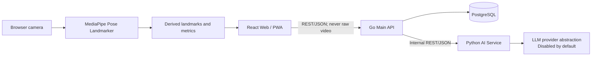

# KineGuide AI

**Personalized recovery, guided by AI.**

**KineGuide AI: A Personalized Physiotherapy Planning and Real-Time Pose Assessment System**

**ระบบปัญญาประดิษฐ์สำหรับวางแผนกายภาพบำบัดเฉพาะบุคคลและประเมินความถูกต้องของท่าทางแบบเรียลไทม์**

KineGuide AI is a university healthcare-AI prototype intended to support safe, understandable physiotherapy experiences. This repository establishes the product architecture, local environment, contracts, tests, and delivery workflow; it intentionally does not yet create diagnoses, patient plans, or exercise recommendations.

## MVP scope

The future MVP will collect consented assessments, apply explicit safety controls, create clinician-informed plans, and measure exercise movement in the browser. The current foundation includes only a bilingual application status screen, health/readiness APIs, a disabled AI provider, and minimal database metadata.



PostgreSQL is reachable only through the Go API. The Python service has no primary-database connection. Raw camera video must remain in the browser and must not be stored or transmitted.

## Technology stack

- Web: React 19, TypeScript, Vite, Tailwind CSS 4, React Router, TanStack Query, Axios, i18next, Vitest, Testing Library, Playwright foundation
- Main API: Go, Gin, pgx/v5, `slog`, OpenAPI 3.1
- AI service: Python 3.12+, FastAPI, Pydantic, HTTPX, pytest, Ruff, mypy
- Data and edge: PostgreSQL 17, golang-migrate, Caddy, Docker Compose
- Package management: pnpm/Corepack and Python `uv` lock format (pip fallback documented)

## Repository structure

```text
apps/web                 React PWA
services/api-go          Go Main API
services/ai-python       Python AI Service
packages/contracts       OpenAPI contracts
packages/ui              Shared design-token guidance
database                 Migrations and safe seeds
research                 Dataset policy and evaluation work
docs                     Architecture, API, privacy, and workflow docs
infrastructure           Caddy and container support
scripts                  Cross-project verification helpers
```

## Prerequisites

- Node.js 22+ and Corepack
- Go 1.24+
- Python 3.12+
- Docker with Compose v2 for the integrated environment
- GNU Make is optional; every command also has a direct equivalent below

## Local installation

```bash
cp .env.example .env
corepack enable
corepack prepare pnpm@11.23.0 --activate
pnpm install
(cd services/api-go && go mod download)
(cd services/ai-python && python -m venv .venv && .venv/bin/python -m pip install -e ".[dev]")
```

On Windows, activate `.venv\\Scripts\\Activate.ps1`. Keep `.env` local; it is ignored. Replace every placeholder secret before any shared or deployed environment.

## Run services separately

```bash
pnpm --filter @kineguide/web dev
(cd services/api-go && go run ./cmd/server)
(cd services/ai-python && uvicorn app.main:app --reload --port 8001)
```

Direct local service configuration uses `apps/web/.env.example`, `services/api-go/.env.example`, and `services/ai-python/.env.example`. The web app defaults to Thai and supports an English language switch.

## Run with Docker Compose

```bash
cp .env.example .env
docker compose up --build
docker compose down
```

Direct development URLs:

- Web: <http://localhost:5173>
- Go health: <http://localhost:8080/health>
- Go OpenAPI/Swagger UI: <http://localhost:8080/openapi.json> and <http://localhost:8080/docs>
- Python docs (when exposed for direct development): <http://localhost:8001/docs>
- Caddy integrated entry point: <http://localhost>

The AI service is not published by Compose; port `8001` is exposed only inside the application network. Port values can be overridden in `.env`.

## Database migrations

```bash
docker compose run --rm migrate -path=/migrations -database="$DATABASE_URL" up
docker compose run --rm migrate -path=/migrations -database="$DATABASE_URL" down 1
```

Migrations support up/down operation. IDs use PostgreSQL UUIDs and timestamps use `timestamptz` in UTC. See [database design](docs/database-design.md).

## Tests and quality checks

```bash
pnpm lint && pnpm typecheck && pnpm test && pnpm build
(cd services/api-go && go fmt ./... && go vet ./... && go test -race ./... && go build ./cmd/server)
(cd services/ai-python && ruff check . && mypy app && pytest)
docker compose config
```

## Git workflow

Work flows from `feature/<issue>-<name>` into `develop`, then from `develop` into protected `main` for a verified release. Use Conventional Commits, small pull requests, issue links, one approval, and passing CI. See [GitHub workflow](docs/github-workflow.md) and [contributing guide](CONTRIBUTING.md).

## Security and privacy

Never commit secrets, health data, datasets, recordings, model artifacts, or `.env` files. Process camera frames locally; transmit derived metrics only. Use data minimization, explicit consent, least privilege, auditable rules, and human clinical review. Report vulnerabilities privately as described in [SECURITY.md](SECURITY.md).

## Known limitations and future phases

This foundation has no authentication, patient records, medical safety rules, plan generation, pose model, production LLM, or production deployment. Planned phases are authentication/consent, assessment and clinician-owned safety rules, exercise/plan management, on-device pose assessment, progress reporting, and controlled clinical evaluation.

## Medical disclaimer

KineGuide AI is a physiotherapy support and educational prototype. It does not provide medical diagnoses and does not replace a physician, physiotherapist, or other qualified healthcare professional.

KineGuide AI เป็นระบบต้นแบบสำหรับสนับสนุนและให้ความรู้ด้านกายภาพบำบัด ไม่ใช่เครื่องมือวินิจฉัยโรค และไม่สามารถใช้แทนแพทย์ นักกายภาพบำบัด หรือบุคลากรทางการแพทย์ที่มีคุณสมบัติเหมาะสมได้
